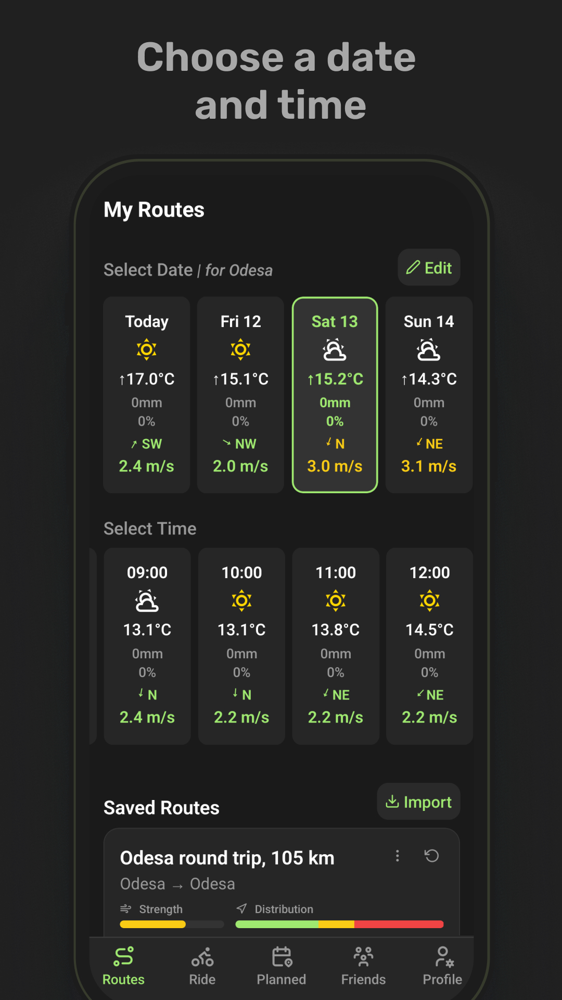
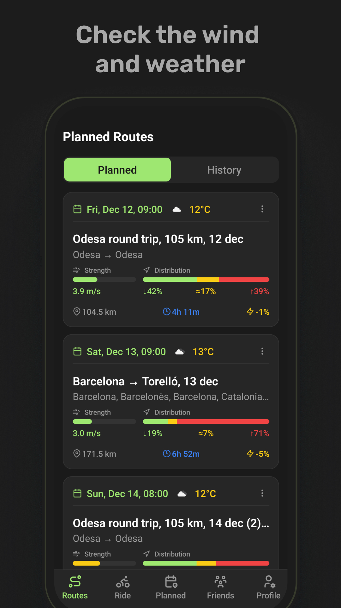
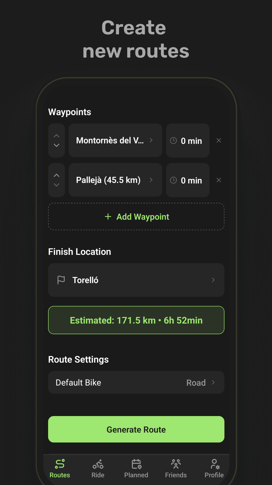
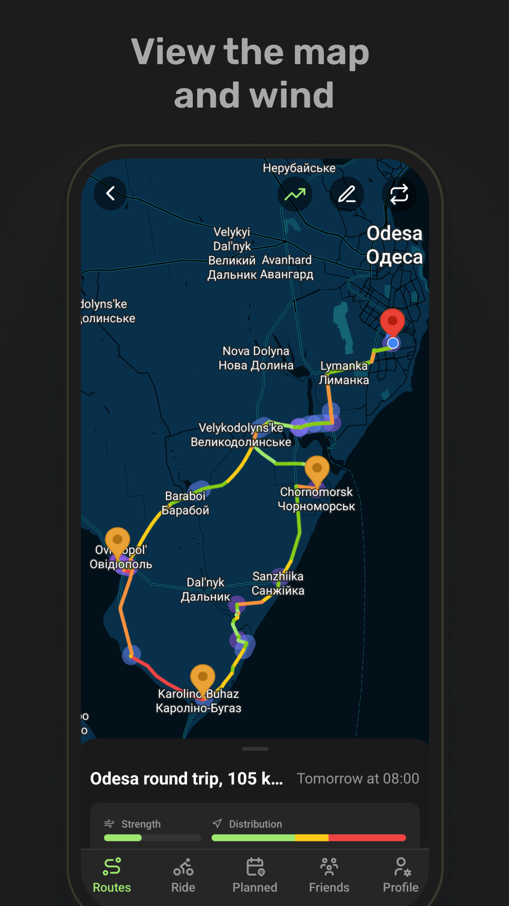
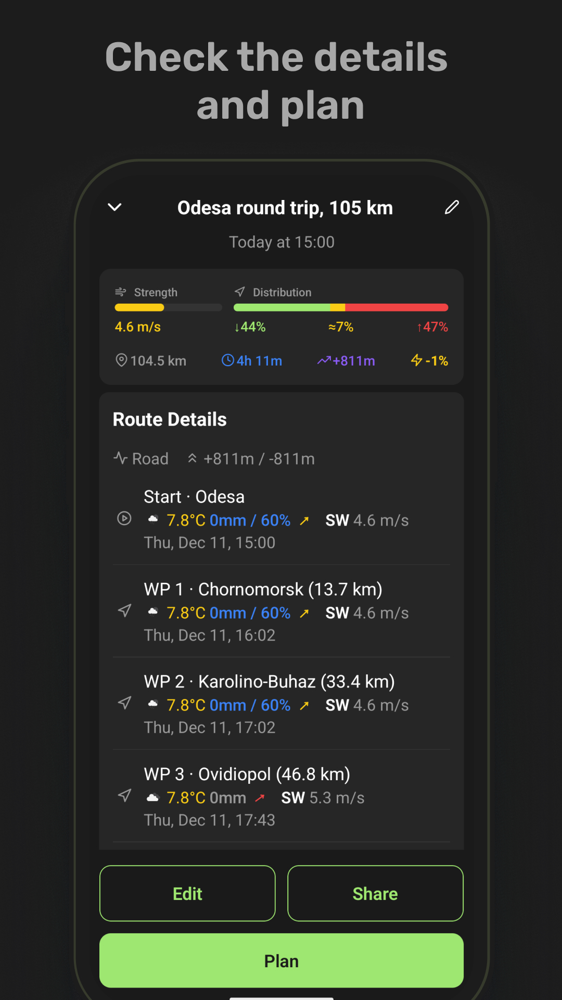

# Wind2Ride — the wind-first cycling route planner

**Plan your ride around the wind — not against it.**

[🌍 wind2ride.app](https://wind2ride.app) • [📱 Google Play](https://play.google.com/store/apps/details?id=com.ikstro.wind2ride) • [💬 Telegram](https://t.me/wind2ride)

---

## What it is

Every cyclist knows the feeling: the ride out was glorious, the ride home was a wall of wind.
Wind2Ride is a **pre-ride planner** that treats wind as the first-class citizen of route planning.
It classifies every segment of your route against the forecast, scores the whole ride, tells you
whether to **flip the direction**, and suggests **which hour to leave** — before you clip in.

No ride tracking, no leaderboards, no GPS recording. It does one job: make sure the wind
works for you.

## How this app was built (the unusual part)

Wind2Ride is designed, architected and shipped by **one person — a product designer, not a
developer** — pair-programming with AI (Claude) end to end: product strategy, UX, architecture
decisions, code, tests, releases. It is a live production app on Google Play with a landing
site, cloud sync, push notifications, six languages, and a CI-tested codebase of ~100 services.

This repository is the **showcase**: real engineering docs and real code excerpts from the
private codebase, published to demonstrate how the product is built.

## Screenshots

    

## Feature highlights

- **5-category wind classification** — every route segment is colored by how it fights or rides
  the wind: tailwind → cross-tailwind → crosswind → cross-headwind → headwind
- **Ride verdict** — one glance answer: is this route good *now*, or better at 17:00, or reversed?
- **Wind-aware route builder** — build on the map or import GPX/Strava; the wind picture updates live
- **Reverse-route comparison** — the same loop can be a different ride backwards; the app checks both
- **7-day / hourly planning** — pick the day and hour, see the wind picture for that exact window
- **Planned rides with weather-drop alerts** — schedule a ride, get notified if the forecast turns on you
- **Route sharing** — web preview links with live wind data for any shared route
- **6 languages** — EN, DE, ES, NL, UK, RU

## Under the hood

The interesting engineering lives in three constraints: **zero-budget infrastructure**
(free-tier APIs only), **mobile-grade performance targets**, and **one-person maintainability**.

| Fact | Detail |
|---|---|
| Stack | React Native 0.79 + Expo SDK 53, TypeScript strict, Expo Router |
| Scale | ~100 services in 14 categories, layered (API → cache → orchestrator → UI state) |
| Wind engine | QuickWI wind index <20 ms; route preview <800 ms P50 |
| Weather economy | 0.315° "weather cell" binning (~35 km) → ~80% cache hit rate on free-tier API |
| Cache map | weather 60 min · routes 1 h · geocoding 6 h/48 h/30 d · elevation 60 d |
| Routing | Provider chain per bike type: BRouter (custom profile) → Valhalla → OSRM |
| Cloud sync | Full routes never uploaded — 1-2 KB "seeds", routes regenerated on device |
| Quality | 33 Jest suites / 300+ tests, typed strict, design-token system, CI typecheck |

### Engineering docs (real, from the codebase)

| Doc | What it shows |
|---|---|
| [ARCHITECTURE.md](./docs/ARCHITECTURE.md) | Data flow, startup sequence, the full cache map — code-verified |
| [WIND_INDEX.md](./docs/WIND_INDEX.md) | The wind algorithm: classification, scoring, display semantics |
| [SERVICES.md](./docs/SERVICES.md) | 100-service catalog with deliberate layering ("do not merge" contracts) |
| [DESIGN_SYSTEM.md](./docs/DESIGN_SYSTEM.md) | Token system: palette, spacing, radii, wind color semantics |
| [REFACTORING_2026_06.md](./docs/REFACTORING_2026_06.md) | Case study: -6 dead services, screens split into domain hooks, verbatim code moves |

### Code excerpts (real, from the codebase)

| Excerpt | The idea |
|---|---|
| [wind-classification.ts](./excerpts/wind-classification.ts) | The single source of truth for wind categories and the app-wide speed→color scale |
| [weather-cell-binning.ts](./excerpts/weather-cell-binning.ts) | How ~35 km coordinate bins make a free weather API feel unlimited |
| [wind-distribution.ts](./excerpts/wind-distribution.ts) | Distance-weighted per-segment difficulty — the heart of the ride verdict |

## Product principles

1. **Pre-ride planner, not a tracker.** No GPS recording, no speed competition — that red line
   keeps the product honest and the scope sane.
2. **Zero-budget infrastructure.** Free tiers only; every cache and batching decision exists
   because of this constraint. The app is free.
3. **Wind is the interface.** Color = direction category, value = speed, one scale everywhere —
   the map, the forecast and the verdict never disagree.

## About the author

**ikstro** — I build design systems and aviation products: white-label design systems
(5 brands live), runtime brand theming from the admin panel, Figma ↔ Token Studio ↔
Storybook pipelines, airline booking engines, two CDPs. Designing since 1997.

Wind2Ride is my side experiment: can a designer ship and operate a full production
product with AI pair-programming instead of a dev team? So far: yes — this app is the evidence.

📫 [LinkedIn](https://www.linkedin.com/in/ikstro/) • [Behance](https://www.behance.net/ikstro) • ikstro.design@gmail.com • [wind2ride.app](https://wind2ride.app) • [Telegram](https://t.me/wind2ride)

## License

**All rights reserved.** The full application source is private. The documents and code
excerpts in this repository are published for demonstration and portfolio purposes only —
see [LICENSE.md](./LICENSE.md). You may read and learn from them; you may not reuse them
in your own products or republish the app.
